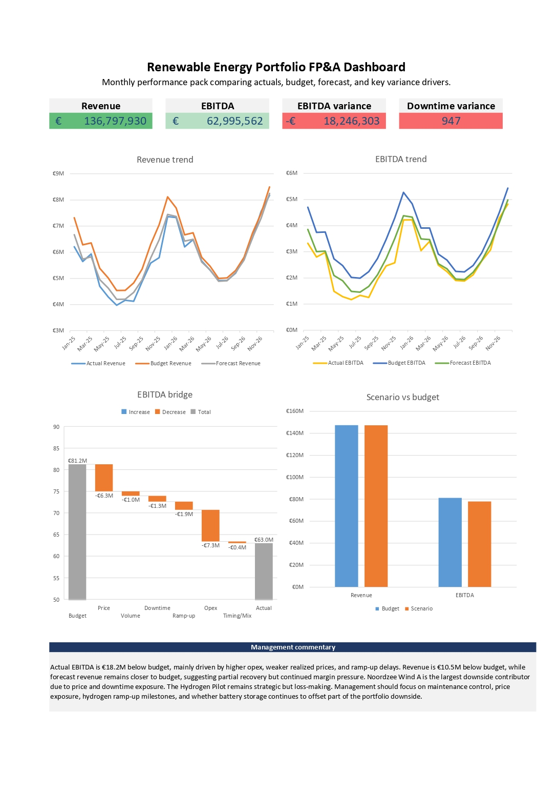
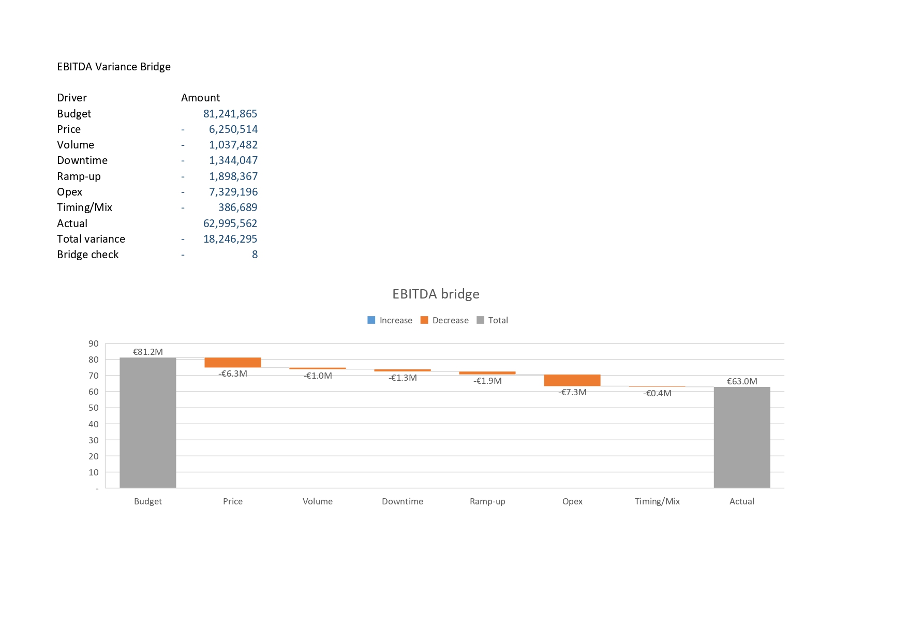
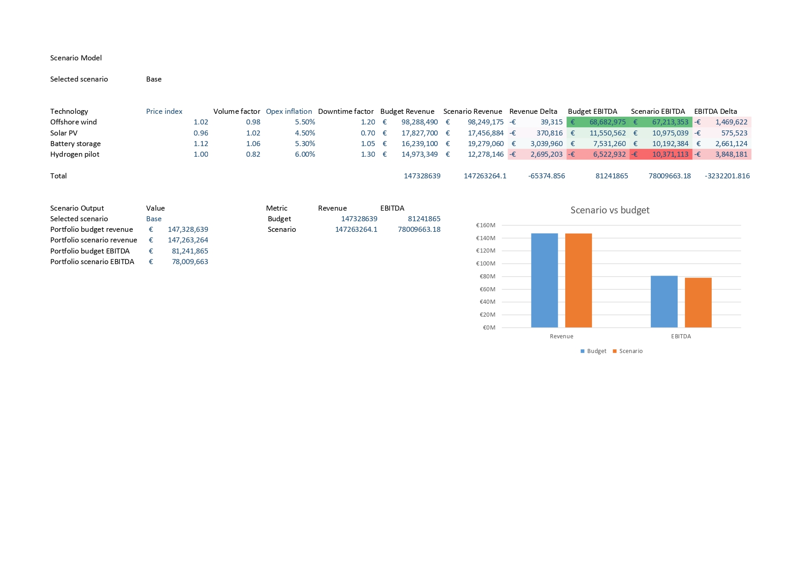

# Renewable Energy FP&A Performance Model

Synthetic Excel-based FP&A and business control model for a renewable energy asset portfolio.

This project demonstrates a junior analyst-style monthly performance pack using Excel, Power Query, structured formulas, variance analysis, scenario modeling, and management dashboarding.

## Dashboard preview



## Analysis previews

### EBITDA variance bridge



### Scenario model



## Project overview

The workbook compares actuals, budget, and forecast performance across a synthetic renewable energy portfolio. It covers revenue, EBITDA, capex, production, downtime, availability, and key variance drivers.

The goal is to show how raw operational and financial data can be turned into a structured monthly performance pack for management review.

## What this demonstrates

This project was built to show practical Excel-based finance and business control skills, including:

- Importing and structuring multiple CSV datasets with Power Query
- Building a combined actuals, budget, and forecast performance model
- Creating portfolio-level and asset-level summaries with structured formulas
- Explaining EBITDA variance through a budget-to-actual bridge
- Testing Downside, Base, and Upside assumptions through a scenario model
- Turning analysis into a management dashboard and written commentary pack

## Business questions answered

The workbook is designed to answer:

- How is the renewable energy portfolio performing against budget and forecast?
- Which assets are driving revenue and EBITDA variance?
- What explains the gap between budget EBITDA and actual EBITDA?
- How do price, volume, opex, downtime, and ramp-up assumptions affect performance?
- What should management monitor next?

## Key features

- Power Query imports for actuals, budget, forecast, assets, assumptions, and variance drivers
- Combined monthly FP&A table
- Portfolio performance summary
- Asset-level performance summary
- Monthly revenue and EBITDA trend charts
- EBITDA budget-to-actual waterfall bridge
- Scenario model for Downside, Base, and Upside assumptions
- Management dashboard and written commentary pack
- Raw data checks and synthetic-data documentation

## Tools used

- Microsoft Excel
- Power Query
- Structured formulas
- Scenario modeling
- Variance analysis
- CSV-based synthetic data

## Repository structure

```text
renewable-energy-fpna-performance-model/
├── data/
│   └── Raw/
├── excel/
│   └── renewable_energy_fpna_model.xlsx
├── screenshots/
│   ├── management_dashboard.jpg
│   ├── ebitda_bridge.jpg
│   └── scenario_model.jpg
├── README.md
└── README_data_notes.md
```

## Synthetic data note

This project uses synthetic data created for portfolio demonstration purposes. Figures are illustrative and do not represent any real company, project, or market recommendation.